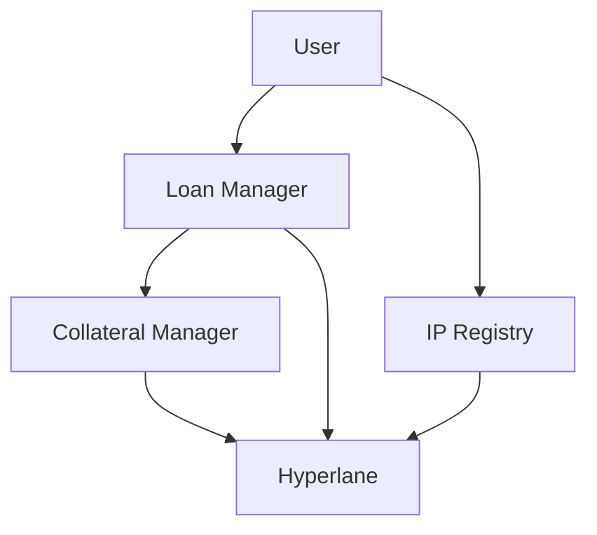

# IP-Backed Lending Protocol

A decentralized lending protocol that enables NFT holders to use their intellectual property as collateral for loans, built during ETH 5 de Mayo and deployed on Arbitrum.

## Why It Matters

The global intellectual property market is valued at over $180B, with significant growth expected in the coming years. However, creators face challenges in:
- Monetizing their IP assets before market success
- Accessing traditional financing due to IP valuation complexity
- Managing cross-border IP rights and licensing

Our protocol bridges this gap by enabling:
- Immediate liquidity for IP holders
- Transparent valuation mechanisms
- Cross-chain IP rights management

## Overview

This protocol enables creators to:
1. Register their intellectual property as NFTs
2. Use these IP NFTs as collateral for loans
3. Manage loan terms and repayments across chains using Hyperlane

## Smart Contracts

### On Camp Chain
- **IP Registry (NFT Contract)**
  - Address: [`0x622D7a12A914A6aB3878E536275F272479Ec15af`](https://basecamp.cloud.blockscout.com/address/0x622D7a12A914A6aB3878E536275F272479Ec15af)
  - Features:
    - Mint soulbound IP tokens
    - Set license terms (commercial use, derivatives)
    - Implement EIP-2981 for royalties
    - Store metadata on Pinata IPFS

- **Collateral Manager**
  - Address: [`0x622D7a12A914A6aB3878E536275F272479Ec15af`](https://basecamp.cloud.blockscout.com/address/0x622D7a12A914A6aB3878E536275F272479Ec15af)
  - Features:
    - Lock NFT collateral during loan period
    - Release collateral upon loan repayment
    - Cross-chain communication via Hyperlane

### On Arbitrum
- **Loan Manager**
  - Address: [`0xA6c526e5B4F3304245D00b7198907534C4cD3B8F`](https://testnet.routescan.io/address/0xA6c526e5B4F3304245D00b7198907534C4cD3B8F/contract/421614/code)
  - Features:
    - Process loan requests
    - Handle loan repayments
    - Calculate interest (5% fixed rate)
    - Cross-chain collateral management

## Architecture



## Key Features

- **Cross-chain Lending**: Utilize Hyperlane for secure cross-chain communication
- **IP Registration**: Secure intellectual property registration with customizable license terms
- **Flexible Loan Terms**: Configurable loan amounts and durations
- **Automated Interest**: 5% fixed interest rate calculated based on loan duration
- **Collateral Management**: Automatic locking and release of NFT collateral

## Technical Stack

- **Frontend**: Next.js, RainbowKit, Wagmi
- **Storage**: Pinata IPFS
- **Cross-chain**: Hyperlane Protocol
- **Smart Contracts**: Solidity 0.8.20
- **Development**: Hardhat, TypeScript

## Getting Started

1. Install dependencies:
```bash
npm install
```

2. Run development server:
```bash
npm run dev
```

3. Build for production:
```bash
npm run build
```

## Environment Variables

Create a `.env` file with:

```env
# Contract Addresses
NEXT_PUBLIC_CONTRACT_ADDRESS=your_ip_registry_address
NEXT_PUBLIC_LOAN_MANAGER_ADDRESS=your_loan_manager_address
NEXT_PUBLIC_COLLATERAL_MANAGER_ADDRESS=your_collateral_manager_address

# Pinata IPFS
NEXT_PUBLIC_PINATA_API_KEY=your_pinata_api_key
NEXT_PUBLIC_PINATA_SECRET_KEY=your_pinata_secret_key
```

To get your Pinata API keys:
1. Create an account at [Pinata](https://app.pinata.cloud)
2. Go to API Keys section
3. Generate a new key with the following permissions:
   - pinFileToIPFS
   - pinJSONToIPFS

## Contributing

This project was built during ETHGlobal Camp hackathon. Feel free to submit issues and enhancement requests.

## License

MIT

## Acknowledgments

- ETH 5 de Mayo
- Frutero Club
